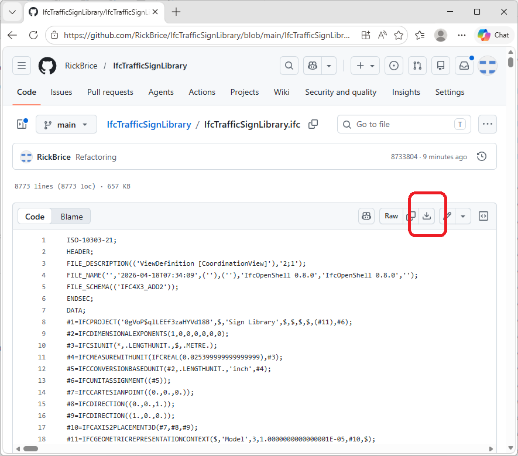
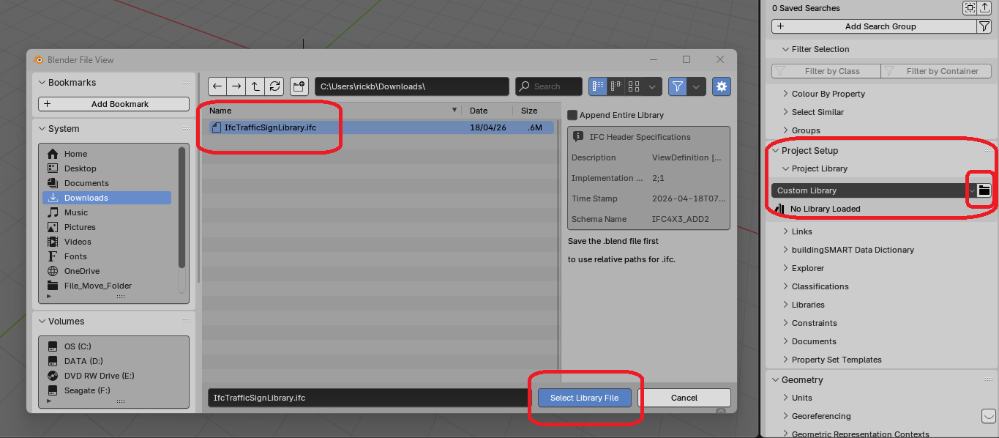
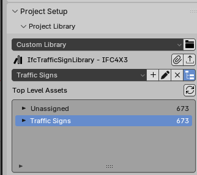
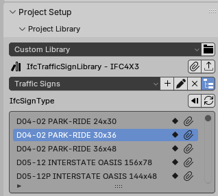
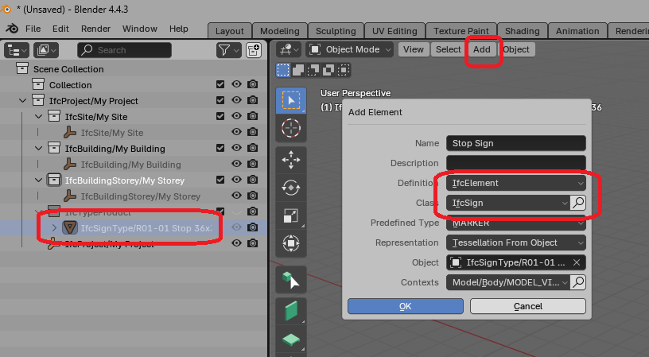
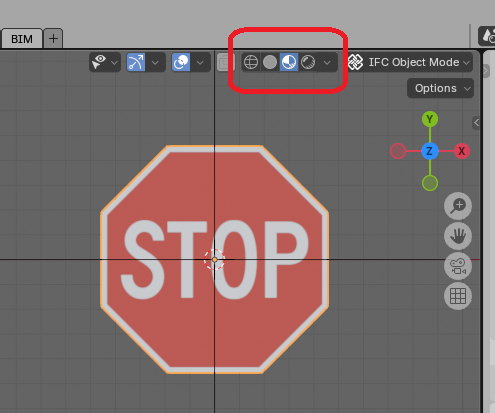

# IfcTrafficSignLibrary

This is a prototype library for US traffic signs based on the [MUTCD](https://mutcd.fhwa.dot.gov/). This library was developed as a demonstration for a Centralized BIM Transportation Library based on the [Towards a Centralized BIM Transportation Library](https://nibs.org/centralized-bim-transportation-library-cbtl-report/).

Note that this work is completely independent of NIBS, FHWA, or anyone else. This is the original work of the repository owner.

## Library Files

Two library files are provided, each using a different approach to represent sign face graphics.

**IfcTrafficSignLibrary_TriangulatedFaceSet.ifc** (37 MB) — The sign face artwork is tessellated into colored triangle meshes using `IfcTriangulatedFaceSet`, with one mesh per paint layer. Colors are applied via `IfcSurfaceStyleShading`.

**IfcTrafficSignLibrary_TextureMapping.ifc** (1.4 MB) — The sign face artwork is applied as a raster image texture mapped onto a flat panel using `IfcIndexedTriangleTextureMap` and `IfcImageTexture`.

### Trade-offs

| | TriangulatedFaceSet | TextureMapping |
|---|---|---|
| Rendering support | Renders in any IFC viewer | Requires texture mapping support |
| MVD compatibility | Included in the Alignment-based View (AbV) MVD | Textures are outside AbV scope |
| Model size | 37 MB — geometry for every color layer | 1.4 MB — geometry is a simple panel |
| External dependencies | None | Requires access to the server hosting the image files |

The `IfcTriangulatedFaceSet` version is the safer choice for broad interoperability. The texture mapping version is about 25× smaller but depends on viewer support for texture mapping and on network access to the hosted image files at the time of rendering.

## How to use this library?

The instructions below are for [Blender/Bonsai](https://bonsaibim.org/), but any IFC authoring tool that supports importing object types from an external `IfcProjectLibrary` can be used in the same way.

Download the library file of your choice by selecting it in the repository and using the Download button.

Start Blender/Bonsai and create a new IFC4x3 project.

On the Project Overview tab, scroll down to Project Setup and expand Project Library. Press the folder icon next to the Custom Library dropdown. Navigate to your Download folder and select the library file. Press Select Library File button to open the library.

In Top Level Assets, click on the arrow for Traffic Signs

Then click on the arrow for IfcTypeProduct and then again for IfcSignType. This will drill down to the individual sign types.

Scroll down the list to find the sign you want. Click on the paperclip icon to import the sign type. This will put the sign type in the Blender Scene Collection under IfcTypeProduct.

Select the sign type in the IfcTypeProduct list.

Select the Add button at the top of 3D Scene View and choose Add Element.

Set the Definition to IfcElement and the Class to IfcSign

The sign model can be completed by adding a post, foundation, materials, etc.

### Texture Mapping Library

> Note: This procedure requires a patch to Blender/Bonsai implemented in PR https://github.com/IfcOpenShell/IfcOpenShell/pull/7961

The sign is added to your model but does not yet show the face texture. To see the texture, enable viewport shading.

The sign face texture is served from a remote host. Ensure you have network access to the image files for the textures to display correctly.

## Implementation Notes

The signs images in the SignFaces folder are grouped into sub folders based on their shape. This was done because the script needs to know the general shape of the sign to generate its representation geometry. Since nothing is encoded in the filename, there wasn't a mapping of MUTCD codes to shape, or other indicators of sign shape, I sorted them manually and used the folder name to indicate shape. This may not be the most efficient or cleanest implementation, but it worked.
